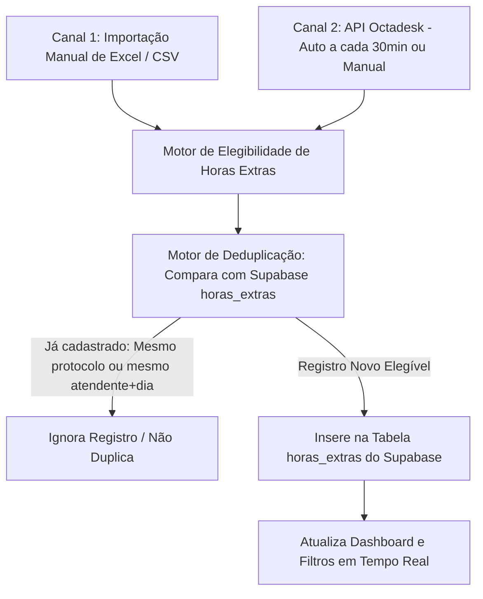

# ⚠️ DIRETRIZ FUNDAMENTAL PARA IA / DESENVOLVEDOR (LEIA PRIMEIRO)

> [!IMPORTANT]
> **REGRA DE OURO DO PROJETO:**
> - **NUNCA altere, refatore, remova ou mexa em nada das outras abas** (`Base de Conhecimento`, `Comandos SQL`, etc.), seja em funcionalidade, elementos HTML, scripts ou visual.
> - **TODO O ESCOPO DE TRABALHO DEVE SER EXCLUSIVAMENTE NA ABA "HORAS EXTRAS"** (`#view-horas` no `index.html` e a seção correspondente no `app.js`).
> - Mantenha sempre a integridade e estabilidade do código já existente.

---

# 🕒 Documentação Mestre: Módulo de Horas Extras

Este documento serve como **ponto de partida e parâmetro geral** para qualquer Inteligência Artificial ou desenvolvedor que for manter, aprimorar ou integrar o módulo de **Horas Extras** deste projeto.

---

## 1. Visão Geral da Arquitetura

O sistema de Horas Extras apura os atendimentos realizados pela equipe de suporte/atendimento e calcula com precisão os minutos de hora extra devidos para cada colaborador.

O sistema opera com uma arquitetura centralizada na nuvem via **Supabase** alimentada por **Dois Canais de Entrada com Deduplicação Estrita**:



---

## 2. Regras de Negócio e Cálculo de Elegibilidade

A função central de apuração no `app.js` é `filterEligibleOvertime(rawItems)`:

### 2.1 Agrupamento Estrito por Dia e Atendente
* **Um único registro por atendente por dia:** Se um atendente realizou múltiplos atendimentos no mesmo dia, o sistema agrupa todos por `responsavel + data` e avalia **apenas o último atendimento do dia** (o horário em que ele realmente encerrou seu expediente e saiu).
* Dias nunca se repetem para o mesmo atendente.

### 2.2 Turnos e Tolerâncias de Saída
* **Segunda a Sexta (Dias Úteis):**
  * **Fim de Expediente Normal (18:00):** Se o encerramento do último atendimento ocorreu com saída após **18:15** (tolerância de 15 minutos):
    - `extra_minutes = minutos_totais - (18 * 60)`
    - `shift_code = 'expediente_18'`
    - `shift_type = 'Fim de Expediente (18:00)'`
  * **Plantão Noturno (19:00):** Se o atendimento se iniciou/passou das 19:00 e encerrou após **19:15**:
    - `extra_minutes = minutos_totais - (19 * 60)`
    - `shift_code = 'plantao_19'`
    - `shift_type = 'Plantão (19:00)'`
  * *Observação:* Intervalos de almoço **não** geram hora extra.
* **Sábados:**
  * **Turno da Manhã (Saída 12:00):** Se encerrou antes das 15:00 e após **12:15**:
    - `extra_minutes = minutos_totais - (12 * 60)`
    - `shift_code = 'sabado_12'`
  * **Turno da Tarde (Saída 18:00):** Se encerrou a partir das 15:00 e após **18:15**:
    - `extra_minutes = minutos_totais - (18 * 60)`
    - `shift_code = 'sabado_18'`
* **Domingos:**
  * **Saída Padrão (13:00):** Se encerrou após **13:15**:
    - `extra_minutes = minutos_totais - (13 * 60)`
    - `shift_code = 'domingo_13'`

---

## 3. Os 2 Canais de Input

### Canal 1: Importação Manual via Planilha Excel / CSV (Admin)
- Localizado no botão de upload `#btnImportarExcel` / `#horasFileInput`.
- Processa arquivos `.xlsx`, `.xls` e `.csv` utilizando as bibliotecas locais `xlsx.full.min.js` e `exceljs.min.js`.
- Mapeia automaticamente as colunas da planilha (protocolo, solicitante, atendente, entrada, encerramento, duração, espera, mensagem).
- Roda o motor de apuração e chama `syncRecordsWithSupabase(cleanRecords, file.name)`.
- Se o atendimento já existir no Supabase, **é ignorado**. Apenas registros inéditos são adicionados.

### Canal 2: Sincronização com a API da Octadesk
- **Credenciais e Endpoints Ativos:**
  - Base URL: `https://o206721-2cb.api004.octadesk.services`
  - API Key: `3f627d9a-59a0-4d90-b5c2-0f5d735a2084.f2f72996-f08d-4055-8ed4-919b83c6798b`
  - Endpoint de consulta: `/chat?filters[0][property]=status&filters[0][operator]=eq&filters[0][value]=closed&sort[property]=closedAt&sort[direction]=desc&limit=100`
- **Frequência de Sincronização:**
  1. **Automática periódica:** Um `setInterval` roda a cada **30 minutos** em segundo plano.
  2. **Automática na carga:** Disparada em background quando a aplicação é carregada.
  3. **Manual sob demanda:** Acionada pelo botão `#btnSyncOctadesk` no cabeçalho do Administrador com feedback visual de rotação e alerta de resultado.
- Converte os chats fechados via `convertOctadeskChatToRawItem`, apura os elegíveis e insere no Supabase via `syncRecordsWithSupabase`.

---

## 4. Banco de Dados: Supabase (`horas_extras`)

- **Conexão:**
  - URL: `https://jqllbwlfikckavipqtfr.supabase.co`
  - Service Role Key configurada diretamente no `app.js` (`SUPABASE_KEY`).
- **Tabela:** `horas_extras`
- **Esquema dos Campos:**

| Coluna | Tipo | Descrição |
| :--- | :--- | :--- |
| `id` | `uuid` | Chave primária gerada automaticamente (`gen_random_uuid()`) |
| `protocolo` | `text` | Número/Protocolo identificador do atendimento na Octadesk |
| `ticket` | `text` | Número do ticket de suporte |
| `responsavel` | `text` | Nome do atendente responsável |
| `solicitante` | `text` | Nome do cliente / revenda |
| `email` | `text` | E-mail do solicitante |
| `telefone` | `text` | Telefone de contato formatado com DDD |
| `organizacao` | `text` | Empresa ou Revenda |
| `status_conversa` | `text` | Ex: `Realizada` ou `Encerrada` |
| `entrada` | `text` | Data e horário de início (`DD/MM/AAAA HH:mm:ss`) |
| `encerramento` | `text` | Data e horário de encerramento (`DD/MM/AAAA HH:mm:ss`) |
| `espera` | `text` | Tempo de espera na fila (`H:mm:ss`) |
| `duracao` | `text` | Tempo total de duração da conversa |
| `mensagem` | `text` | Descrição / resumo / primeira mensagem |
| `timestamp` | `timestamptz` | Data e hora ISO UTC de encerramento |
| `date_iso` | `date` | Data formato `AAAA-MM-DD` |
| `date_str` | `text` | Data formato `DD/MM/AAAA` |
| `time_str` | `text` | Horário formato `HH:mm:ss` |
| `shift_type` | `text` | Nome amigável do turno (ex: `Fim de Expediente (18:00)`) |
| `shift_code` | `text` | Código do turno (`expediente_18`, `plantao_19`, etc.) |
| `standard_time` | `text` | Horário base de referência (`18:00`, `19:00`, etc.) |
| `extra_minutes` | `integer` | Total de minutos excedentes apurados |
| `created_at` | `timestamptz` | Data de inclusão no banco (`now()`) |

---

## 5. Interface e Componentes Visuais (UI / UX)

### 5.1 Seletor de Atendentes Customizado (Admin)
- **Componente:** Substitui o `<select>` nativo do browser por um dropdown dark glassmorphic:
  - Elemento `#adminAgentDropdownBtn` com avatar, nome selecionado e chevron com rotação animada.
  - Dropdown `#adminAgentDropdownMenu` contendo campo de busca rápida (`#adminAgentSearchInput`) e lista de opções com barra de rolagem estilizada (`#adminAgentOptionsList`).
  - Cada opção exibe o avatar com inicial colorida, nome do atendente, badge de métricas (ex: `4 atendimentos • 2h 15m`) e ícone de checkmark.
  - Mantém o `<select id="adminAgentSelect" class="hidden">` sincronizado em background para compatibilidade com a exportação para Excel.
  - Fechamento inteligente com clique fora e tecla `Escape`.

### 5.2 Filtros de Turno e Busca
- Tabs de turno:
  - `Todos os Atendimentos` (`all`)
  - `Saída (18h)` (`expediente_18`)
  - `Plantão (19h)` (`plantao_19`)
  - `Fim de Semana` (`weekend` / `sabado` / `domingo`)
- Campo de pesquisa em tempo real por ticket, assunto ou solicitante (`#horasSearchInput`).

### 5.3 Ações Administrativas (Visíveis apenas para Admin)
- `#btnSyncOctadesk`: Dispara sincronização com a API Octadesk instantaneamente.
- `#btnImportarExcel`: Importa planilha Excel local com apuração e deduplicação.
- `#btnExportarHorasExcel`: Exporta os atendimentos filtrados para `.xlsx` formatado com cabeçalhos e totais.

### 5.4 Cópia Rápida de Protocolo para Área de Transferência
- **Função:** `window.copyProtocolo(protocolo, event, element)`
- Ao clicar sobre o badge de protocolo no card de atendimento ou no modal de detalhes, o número do protocolo é copiado instantaneamente para a área de transferência (`navigator.clipboard.writeText`), facilitando a busca rápida na Octadesk.
- Exibe feedback visual elegante na cor verde com ícone de checkmark e texto "Copiado!" por 1,5 segundos.

---

## 6. Mapeamento de Arquivos no Workspace

```
BASE-DE-CONHECIMENTO-main/
├── README.md                 <-- Este guia mestre (regras e arquitetura de Horas Extras)
├── index.html                <-- Estrutura HTML: aba #view-horas (linhas ~260 a ~365) e modal #horasTicketModal
├── app.js                    <-- Lógica JS: seção ATENDIMENTOS HORAS EXTRAS MODULE (linhas ~2255 a ~3850)
├── style.css                 <-- Estilos complementares e classes personalizadas
├── exceljs.min.js            <-- Biblioteca para geração de planilhas Excel avançadas
├── xlsx.full.min.js          <-- Biblioteca SheetJS para leitura e parsing de planilhas
└── octadesk_api_docs/        <-- Documentação oficial de referência da API da Octadesk
```

---

## 7. Recomendações para Qualquer Alteração Futura

1. **Nunca quebre o contrato de deduplicação:** Qualquer inserção de atendimentos DEVE passar por `syncRecordsWithSupabase()` ou verificar contra `existingProtocols` e `existingAgentDays`.
2. **Valide a sintaxe sempre após editar:** Execute no terminal `node --check app.js` para garantir integridade.
3. **Não remova o fallback de compatibilidade:** O `<select id="adminAgentSelect">` oculto deve continuar tendo seu `.value` atualizado pelas opções customizadas para não quebrar a exportação para Excel.
4. **Preserve todas as outras abas:** Lembre-se sempre de que nada fora da aba `Horas Extras` deve ser alterado.
